# De  Hel van het Eschmarkerveld

## Inleiding

De Hel
van het Esschmarkerveld is een stuk
in vier aktes. Elk van de aktes is gebaseerd op ware gebeurtenissen.
Iedere akte speelt zich, op of rond de plek af, waar op 7 april 1990 een
huis werd getroffen door een meteoriet. 

AKTE I - De
eerste akte beschrijft de val van de meteoriet vanuit wetenschappelijk
perspectief, aan de hand van twee publicaties. De manier waarop dit
gespeeld wordt staat open voor eigen interpretatie van de regiseur en/of
de spelers van het stuk. 

AKTE II - De
tweede akte speelt exact 25 jaar later. Op de plek van de inslag wordt
een gedenk- teken onthuld in de vorm
van een grote zwerfkei met daarop een plaquette ter nagedachtenis van de
meteoriet-inslag. Het huis waar de meteoriet destijds insloeg is
inmiddels afgebroken. Ook gaan er stemmen op de meteoriet terug te halen
naar Glanerbrug, deze bevindt zich nu in Leiden. 

AKTE III - In
de derde akte wordt een gebeurtenis op 25 november 2015 gespeeld. Die
ochtend werden er rond de plek van de meteorietinslag een aantal
afgehakte varkenskoppen aangetroffen. Deze koppen zijn de nacht daarvoor
geplaatst door tegenstanders van een asielzoekerscentrum, in de hoop dat
dit voor eventuele Islamitische asielzoekers een afschrikkende werking
zou hebben. Centrale rol is weggelegd voor de varkenskop die op de
herdenkingssteen van de meteorietinslag is gelegd. De akte begint met de
berichtgeving in de krant Tubantia. Het grootste deel van deze akte
bestaat uit de reacties van lezers op dit artikel. Deze reacties moeten
worden voorgedragen door afzonderlijke acteurs, als de monologen en
dialogen die het zijn, rond de bovengenoemde steen. 

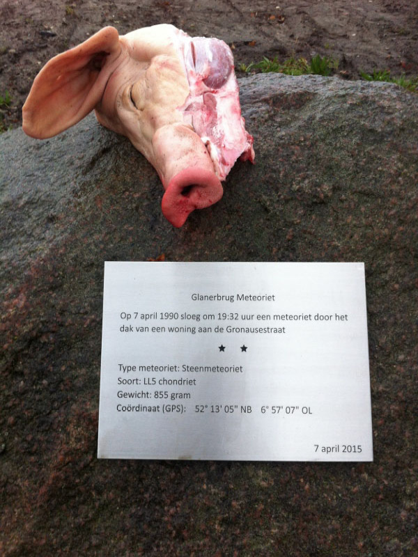

AKTE IV - De laatste akte bestaat uit de corespondentie tussen een kunstenaar
die een voorstel doet voor een kunstwerk, en de verantwoordelijk
wethouder van de gemeenste Enschede. De kunstenaar in kwestie biedt aan
een varkenskop in brons te maken en deze op de herdenkingssteen te
monteren zoals de tegenstanders uit Akte II het oorspronkelijk hadden
gedrappeerd.  Voorzover mogelijk
stel ik voor de rollen waarmogelijk door de volgende personen te laten
vertolken.

* de meteoriet F. Sinatra
* de aarde C. Elliot
* de wetenschappers Prof. T. Zonnebloem & Dr. Dre
* familie Wichman B. Klein & J. Arnold
* verslaggever Tubantia Ivo Niehe
* woedende menigde Inwoners Glanerbrug
* de herdenkingssteen De steen zelf
* wethouder B. Clinton
* secretaresse M. Lowinsky
* kunstenaar F. Kahlo

### GLANERBRUG

Glanerbrug is een Overijssels dorp ten oosten van
de stad Enschede. Het ligt aan de rijksgrens met Duitsland die hier op
een natuurlijke wijze wordt gevormd door de Glanerbeek, aan de overkant
waarvan zich de Duitse stad Gronau bevindt. Glanerbrug ontleent zijn
naam aan de brug over deze beek en valt onder de gemeente Enschede. In
het zuiden en westen grenst Glanerbrug direct aan de nieuwbouwwijken van
De Eschmarke, waardoor de grenzen met de stad Enschede zijn
vervaagd.

Op 7 april 1990 boorde een meteoriet zich
door het dak van een woonhuis. Deze heeft de naam Glanerbrug-meteoriet
gekregen.

## AKTE I

“Vuur uit de Hemel & Dood van bon”

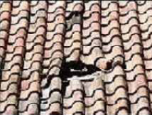

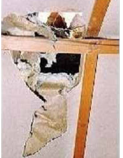

Lunar and Planetary Science XXXVII

> GLANERBRUG - AN LL4-6 FRAGMENTAL BRECCIA
> WITH HUGE L CHONDRITIC CLASTS. M.
> Niemeier and A. Bischoff, Universität Münster, Institut für
> Planetologie/ICEM, Wilhelm-Klemm-Str. 10, 48149 Münster, Germany
> (bischoa@uni-muenster.de). Introduction: The Glanerbrug ordinary
> chondrite fell April 7, 1990 through
> the roof of a house in the Netherlands \[1,2\]. The inhomogeneous
> character of the rock was recognized
> immediately \[1\] and Glanerbrug was officially classified as an LL breccia
> \[3\]. In later publications
> Glanerbrug was described as an L/LL5
> chondrite (e.g., \[4\]). Based on the somewhat unclear and inconsistent classification we have
> studied Glanerbrug in detail
> again. Results: Welten et al.
> \[2\] found that within the main
> fragment of Glanerbrug a dark-grey breccia occasionally containing blackish inclusions is
> separated from a light-grey
> lithology by a sharp boundary. We have studied several polished thin sections of
> Glanerbrug (PL04055 and PL04057) by
> optical and electron microscopy and
> electron microprobe. The two different units described by \[2\] are probably those
> shown in Figures 1 and 2.
> Unit One. This brecciated lithology (Fig.
> 1) is well characterized by the
> light-dark structure. Various types of clasts (types 4-6) are embedded in a clastic,
> porous matrix (Fig. 3). The
> fine-grained, dark clastic matrix can be recognized as the host material as already
> suggested by \[2\]. This dark
> portion is less homogenous than the
> light lithologies. Welten et al. \[2\] found that olivines within the dark portions of two thin
> sections have quite variable
> compositions (27.0 ± 1.5 and 30.0 ±
> 1.0 mol% Fa, respectively). Analyses of olivines and pyroxenes within the clastic matrix of our sample
> revealed 29.5 ± 1.7 mol% Fa and 23.5
> ± 4.1 mol% Fs, respectively. Thus,
> these results would indicate an LL chondritic origin. Based on the standard
> deviation the matrix can be
> considered as slightly unequilibrated; however, this may be due to a small abundance of
> tiny L-group clasts within the
> fine-grained matrix. No olivines or
> pyroxenes with really low Fa- or Fs-contents were detected. As shown in Fig. 1 many
> different types of fragments were
> embedded within the dark clastic
> matrix. Several clasts have been analyzed in detail. The fragments F01, F08, F10, F12, and F13
> are well recrystallized and clearly
> of petrologic type 6; the average
> Fa-content of each clast is close to 31 mol% \[5\]. Thus, these clasts are clearly of
> LL-chondritic composition. Olivines
> of other fragments have lower Fa-contents (compare Figs. 1 and 4; average
> values in mol% Fa): F07: 27.8, F02:
> 27.3, F03: 28.0, F09: 29.3, F05:
> 27.3, F04: 26.4, F06: 25.6 \[5\]. Although a gradation between LL-and L-chondritic materials can
> be recognized, the last two
> fragments can be classified as L-chondritic clasts. Unit Two. This lithology shown in Fig. 2 is
> lightcolored and contains
> chondrules. Petrologically, it can be characterized as a type 4/5 lithology.
> Olivines and pyroxenes within this
> lithology are well equilibrated (average: 25.6 mol% Fa and 21.8 mol% Fs,
> respectively \[5\]) and clearly
> within the range of L-chondritic material (high Fa-Fs end of the L-field). This
> lithology can be regarded as a huge
> L-chondrite fragment within the LL
> chondritic bulk rock. General
> observations: The matrix of Glanerbrug is not well lithified. The lithic constituents are
> very angular and a high degree of
> porosity occurs between individual clasts. Thus, Glanerbrug can be classified as
> a Class A breccia concerning the
> degree of lithification \[6\].
> Based on the lack of solar wind implanted noble gases Glanerbrug is a fragmental breccia
> \[7\]. Using the shock stage
> classification scheme of \[8\] the bulk rock is only very weakly shocked (S2;
> \[4,5\]). Some of the type 6
> fragments show shock veins. Discussion: Glanerbrug is a very complex
> fragmental breccia. We suggest that
> the host rock is of LL chondritic
> origin as already stated by \[2\]. The parent body has incorporated xenolithic fragments,
> which represent material of the high
> Fa-Fs end of L chondrites/ low Fa-Fs
> end of LL chondrites (Fa: 25.5-28 mol%). Mixing and lithification occurred close
> to, but certainly not at the upper
> surface of the parent body as indicated by the lack of solar wind implanted
> noble gases \[7\]. Based on our
> results we classify Glanerbrug as an
> LL4-6 fragmental breccia with huge L-chondritic clasts. References: \[1\] Lindner L. et al. (1990)
> Meteoritics, 25, 379-380. \[2\]
> Welten K. C. (1992) Meteoritics, 27., 307. \[3\] Wlotzka F. (1991)
> Meteoritical Bull. Meteoritics, 26,
> 68-69. \[4\] Rubin A. E., (1994) Meteoritics, 29, 93-98. \[5\] Niemeier M. (2005) Diploma
> thesis, Institut für Planetologie,
> Universität Münster, 1- 193.
> \[6\] Bischoff A. et al. (1983) Earth Planet. Sci. Lett., 66, 1-10,. \[7\] Loeken T. et al.
> (1992) Meteoritics, 27, 251.
> \[8\] Stöffler D. et al. (1991) Geochim. Cosmochim. Acta, 55, 3845-3867.

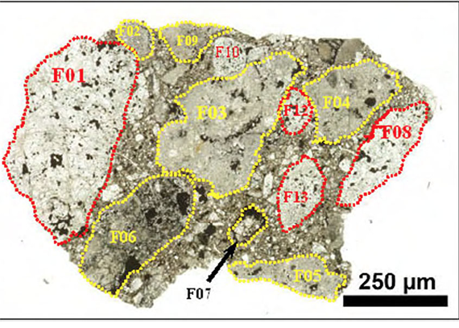

Fig. 1: The dark lithology (Unit One) of
the Glanerbrug ordinary chondrite
fragmental breccia. Various type of
clasts are embedded within a fine-grained, dark clastic matrix.

Fig. 3: The fine-grained, dark matrix (Type
A) of Glanerbrug. Note the clastic
appearance of the constituents and
the high portion of porosity (black areas). Photograph taken in reflected light.

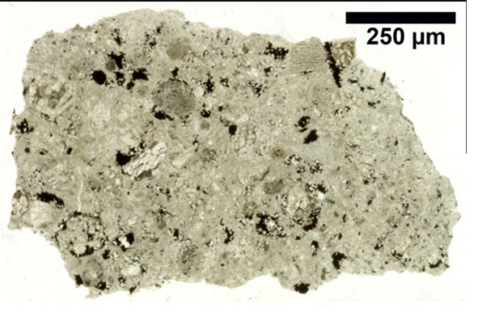

Fig. 2: The light lithology (Unit Two) of
the Glanerbrug fragmental breccia.
Various types of chondrules are
clearly visible

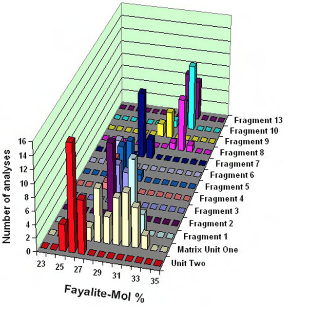

Fig. 4: Composition of olivines in various
clasts (compare Fig. 1) and within
the fine grained dark matrix of
Glanerbrug (data in mol%).

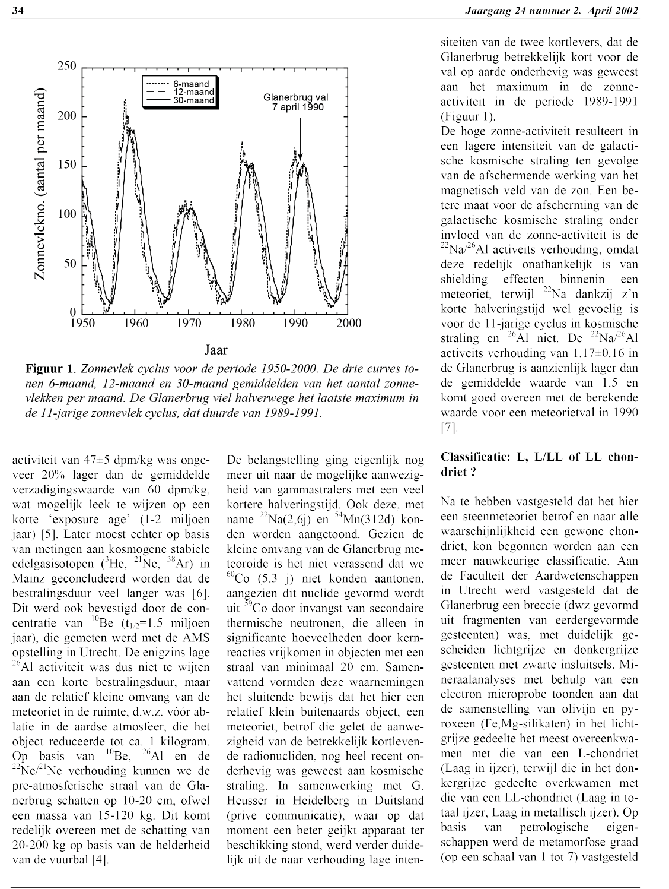

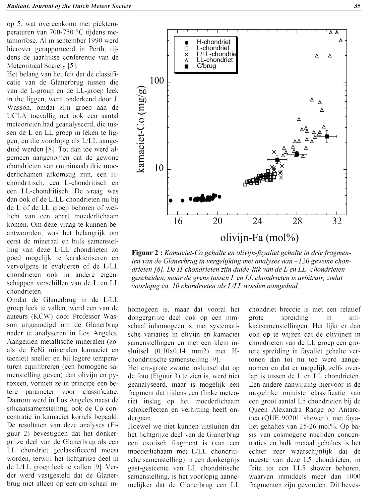

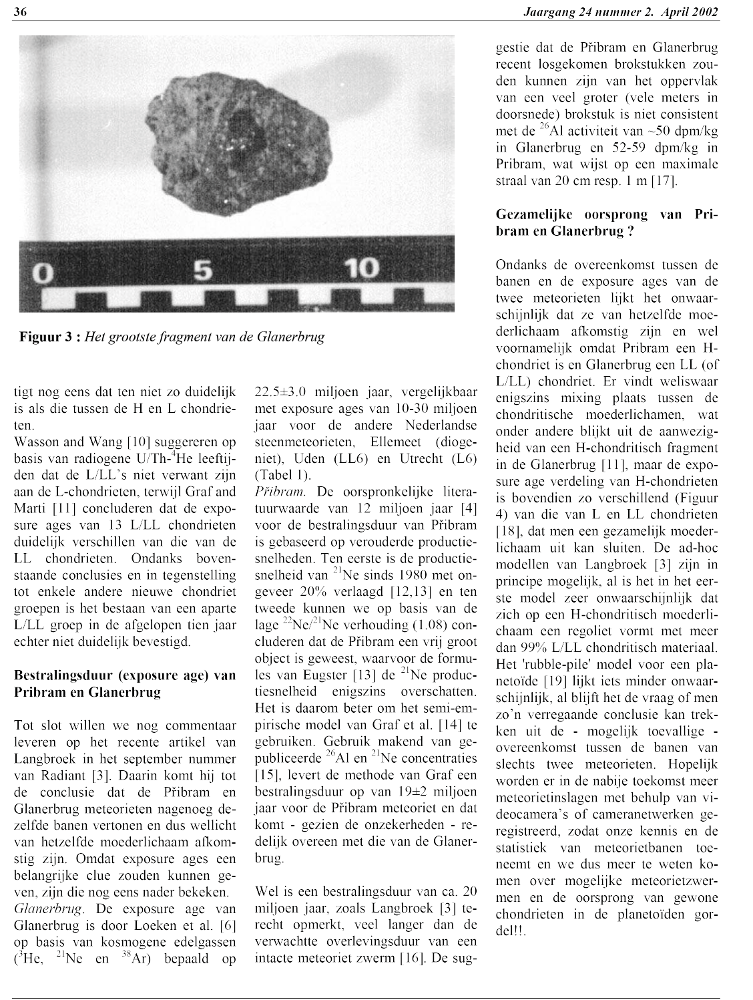

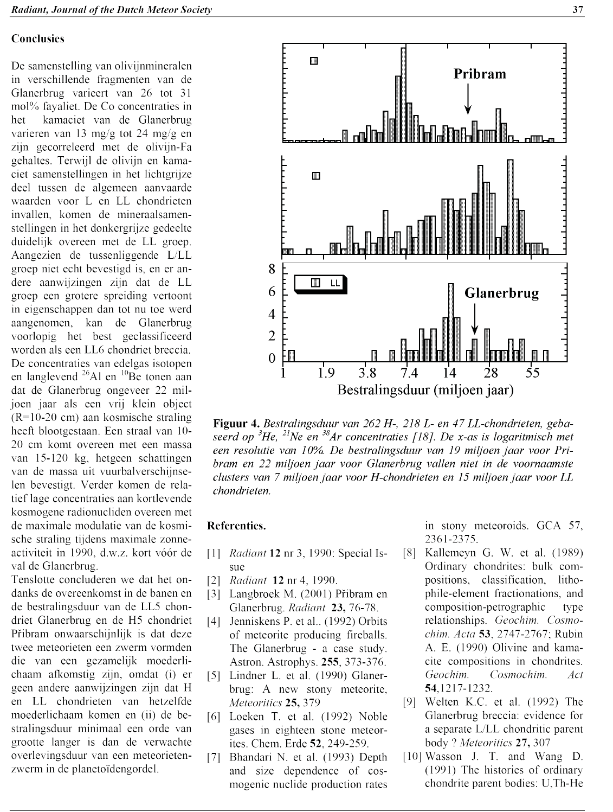

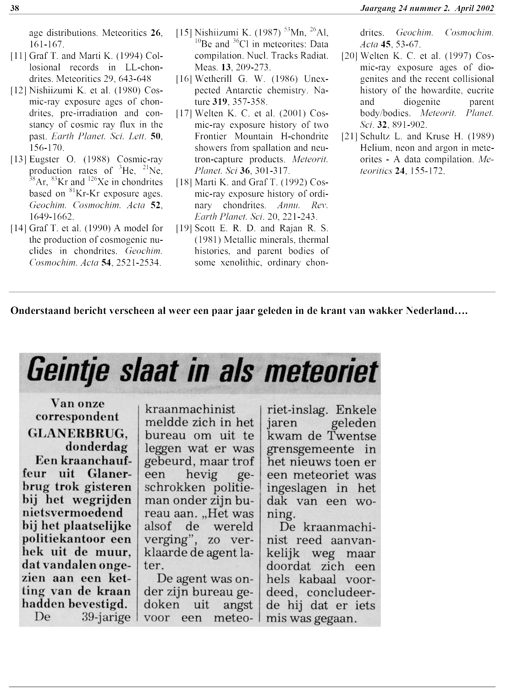

## AKTE II

“Het Geluk van de Herinnering”

Abonneren Digitale Krant Contact Regionaal
Weather nu 10°C Traffic 1 file

### Glanerbrug herdenkt inslag meteoriet met plaquette

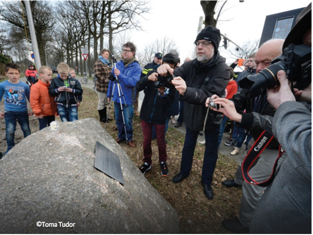

GLANERBRUG - Het was 7 april 1990, 19.32
uur, toen een meteoriet van 855 gram insloeg in het woonhuis van de
familie Wichmann aan de Gronausestraat tussen Enschede en Glanerbrug. Nu
is er een plaquette.

De plaquette
werd precies 25 jaar na de inslag onthuld door wethouder Jeroen
Hatenboer, door een fles ‘meteorietbitter’ kapot te gooien op de
zwerfkei met plaquette. „Die inslag had een geweldige impact op een
heleboel mensen. Zoals op politieagenten Bennie Beuvink en Rob Meijerink
van het bureau Glanerbrug”, weet hij. Zij namen poolshoogte toen mevrouw
Wichmann belde om te melden dat vandalen het op haar huis hadden
voorzien.

**Fragment**

Ter gelegenheid van de onthulling, was dr. Marco
Langbroek, autoriteit als het gaat om meteorieten, naar Glanerbrug
afgereisd om een college te geven. Hij heeft zelfs een fragment van de
Glanerbrug-meteoriet uit museum Naturalis in Leiden meegenomen. „Het
bijzondere aan deze steenmeteoriet is dat hij uit lichte en donkere
stukken bestaat”, zegt Langbroek. „Door een botsing zijn twee stukken
samengevoegd. Ze hebben meer dan 20 miljoen jaar door de ruimte
gezweefd. En dan slaat zo’n vuistdik brokstuk als een kleine tijdcapsule
neer in het huis van de familie Wichmann.”

**Museum**

Het
initiatief voor de plaquette kwam van dorpsbewoners Henk Louis Maas en
Joan Oldersma. Ze hebben nu nog een wens: dat een fragment van de
meteoriet van Leiden naar museum TwentseWelle in Enschede verhuist.

WAT VINDT U? 
Laatste reacties (1)

**janos** 
Verdorie dat klopt. Ik kan mij de  berichtgeving van toen nog herinneren. 
Datum geplaatst 8 april 2015, 15:17

### Nieuws » ’Glanerbrug wil grootste deel van meteoriet terug’

dinsdag 7 april 2015 | 16:03 Laatst bijgewerkt: 7-4-2015 | 16:02

**Glanerbrug wil het grootste deel van de
meteoriet terug die exact 25 jaar geleden op het huis van de familie
Wichman aan de Gronausestraat viel.**

De meteoriet ligt nu een museum in Leiden.
Initiatiefnemers Henk Louis en Joan Oldersma betreuren dat. Bij de
onthulling van een plaquette in de vorm van een zwerfkei op de plek van
de inslag, heeft het duo dit bepleit bij wethouder Hateboer.

**Stuk steen op zolder woning** 
De woning van de familie Wichman waar de
meteoriet werd gevonden op 7 april 1990 is inmiddels afgebroken.
Aanvankelijk werd bij de vondst op zolder nog gedacht aan vandalisme. Al
snel bleek het echt om een stuk ruimtesteen te gaan.

**Vijfde meteoriet in Nederland** 
Honderden mensen in Nederland, Duitsland en zelfs
Denemarken zagen op die vroege avond in april een heldere vuurbol aan de
hemel die zich met grote snelheid in zuidwestelijke richting bewoog. De
meteoriet uit Glanerbrug is de vijfde die in een periode van 175 jaar in
Nederland is ingeslagen. Initiatiefnemer Joan Oldersma heeft een heel
klein deel van de meteoriet via via kunnen bemachtigen. Vier jaar
geleden kreeg hij het in handen via een verzamelaar uit Brabant.

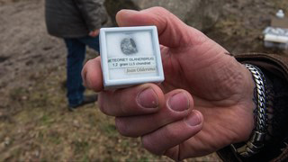

Klein stukje van de meteoriet Foto: RTV Oost / Rogier van den Berg

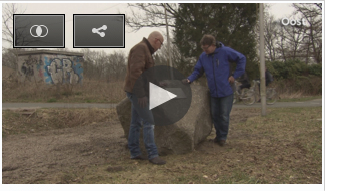

Onthulling van zwerfkei met
plaquette Bekijk op YouTube

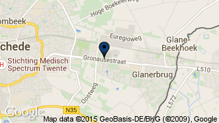

Nieuws op de kaart Het laatste nieuws op de kaart van
Overijssel

## AKTE III

“Het Ontstelde Volk & het
Zwijn”

ENSCHEDE - Onbekenden hebben in de nacht van dinsdag op
woensdag nabij het Eschmarkerveld in Enschede, waar een groot
asielzoekerscentrum wordt gebouwd, veertien varkenskoppen
neergelegd. De varkenskoppen lagen
woensdagmorgen nog bij de toegang van het terrein. Voorbijgangers
reageerden geschokt. Negen varkenskoppen liggen op het hek, vier andere
koppen liggen op de grond en één kop hangt in een stoplicht. Sommige
varkens hebben nog oormerken in. Er ligt ook een plastic zak vol bloed
waar de koppen in hebben gezeten. 

**“Walgelijke actie”** Een woordvoerder van de politie spreekt van “eenwalgelijke actie om zo duidelijk zichtbaar varkenskoppen neer te
leggen.” Hij acht het niet waarschijnlijk dat de koppen zomaar gedumpt
zijn, daarvoor lagen ze te nadrukkelijk uitgestald. De gemeente is
inmiddels gevraagd de kadaverdelen op te ruimen.   

**“Milieudelict”** De politiewoordvoerder benadrukt, dat er ‘geen
gerichte bedreiging’ is geuit, bijvoorbeeld met een een tekst bij de
koppen. Daarom is er ook nog geen bewijs van een actie die bedoeld is
tegen de komst van het azc. 

“Er is in elk geval spraken van een 
milieudelict”**, zegt de woordvoerder, “en als er inderdaad oormerken zijn
aangetroffen, dan gaan we zeker dat onderzoeksspoor volgen.”
  

**“Geen politieke actie”** Wethouder Jurgen van Houdt, verantwoordelijk
wethouder voor de komst van het azc naar Eschmarkerveld, geeft volgens
zijn woordvoerder geen reactie op de vondst van de varkenskoppen. “Er komt geen politieke reactie, omdat er geen duidelijke relatie is
aangetoond tussen deze vondst en de komst van het azc. De politie heeft
geen boodschap gevonden die daar op zou wijzen”, aldus de
woordvoerder.

.jpg)

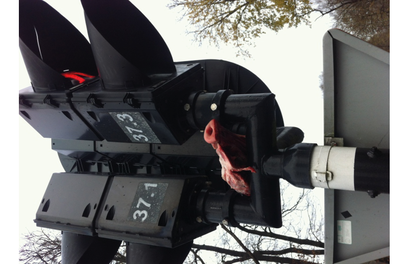

.jpg)

.jpg)

.jpg)

.jpg)

**Twitter** Een foto van de koppen is gedeeld op Twitter met
daarbij de tekst: ‘Als de democratie faalt dan worden mensen boos en
wanhopig. Welkom in de hel van het Eschmarkerveld’

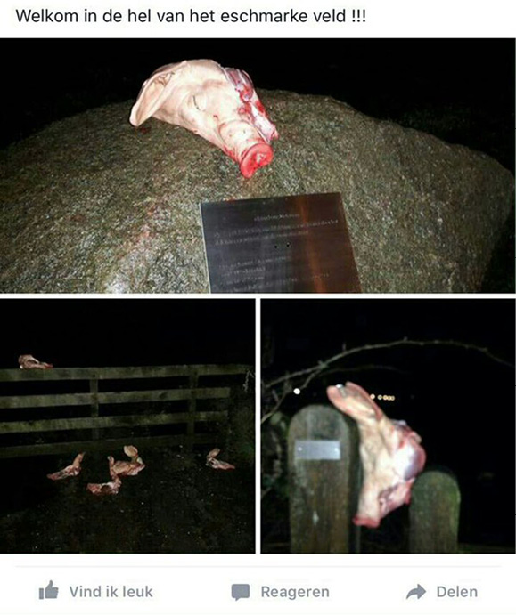

### WAT VINDT U? Laatste reacties (153)

**Anja** 
Mensen zijn radeloos, een wanhoopsdaad........
Er komen nog veel grotere problemen.... 
 
Datum geplaatst 25 november 2015, 10:50

**you know** 
Fout. Vluchtelingen zijn radeloos. Mensen die
dit doen zijn alleen maar dom. 
 
Datum geplaatst 25 november 2015,12:00 

**Anja** 
Vluchtelingen ja, maar het merendeel is
gelukzoeker, zie al door 7 veilige landen is getrokken omdat ze denken
dat het hier Luilekkerland is. Ik heb Somaliers naast mij wonen, die
gewoon 6 weken op vakantie gaan naar Somalie. Ze zeggen gewoon dat ze
niet willen werken, ze hebben liever een uitkering. 
 
Datum geplaatst 26 november 2015,04:15

**Maria** 
je kunt niet alle asielzoekers over een kam
scheren. Naast jou wonen Somaliers. Misschien zou je eens kennis met hun
moeten maken voor je een vooroordeel hebt. En dat deze mensen naar
Somalie gaan mag dit niet? Wie zegt trouwens dat ze daar heen gaan. Zijn
dat ook weer roddels of je denkt zo. Je moet geen oordeel hebben als je
je er niet in verdiept hebt. 
Anja een tip nodig je buurvrouw uit en wie
weet bouw je een vriendschap op wat je nooit verwacht zou hebben.
Kletsen doen mensen toch en misschien ook wel over jou! 
 
Datum geplaatst 27 november 2015,15:03

**Erik** 
Dag Anja, ik ben een gelukszoeker en ik vermoed
jij ook.... Mijn grootste geluk tot nu toe is dat ik in Nederland ben
geboren. Heb ik niets voor hoeven doen..... 
 
Datum geplaatst 26 november 2015,18:42

**Inge** 
Ja Erik, als je het zó bekijkt is iedereen een
gelukszoeker. Maar ik, en vermoedelijk ook jij, en ook Anja, presenteren
de rekening daarvoor niet aan een ander. Want dat is de hamvraag: wie
betaalt de dagelijks groeiende rekening? 
 
Datum geplaatst 27 november 2015,15:17

**hannibal** 
Hoe dat zo? Heb je er ervaring mee Anja?
Radeloos en dat je dan varkenskoppen neerlegt. De reacties van de meeste
mensen zijn negatief t.o.v. deze figuren. Misschien liggen er binnenkort
wel varkenskoppen bij jou in de tuin! Hoe reageer je dan? 
 
Datum geplaatst 27 november 2015,15:10

**julot** 
Dit soort nederlanders lijken op deze
varkenskoppen ,dit is gewoon hun visitekaartje ,al vind ik het wel een
belediging voor de varkens zelf dit hebben de varkens niet
verdiend. 
 
Datum geplaatst 27
november 2015,09:36 

**Inge** 
Een varkenskop is geen bom, gelukkig maar.
En misschien willen degenen, die de koppen smakeloos of schokkend
vinden, zich even realiseren dat de rest van het varken ‘s avonds op hun
bord ligt? 
 
Datum geplaatst 25
november 2015,14:46

**Lezer** 
Een varken heeft een gezicht. Is
intelligenter dan een hond en aap. De kinderstoel maar aan tafel
schuiven voor u? 
 
Datum geplaatst 25
november 2015,20:50 

**Muslim Achtien** 
Niet bij ons...
 
Datum geplaatst 26 november 2015,
09:31

**Kas** 
Beste Inge, wat een vreemd verband leg je daar.
Iedereen die varkensvlees eet moet deze gedumpte varkenskoppen dus maar
accepteren? Of wil je jezelf neerzetten als een voorstander van een
vegetarische samenleving? Met andere woorden: wat is je punt
precies? 
 
Datum geplaatst 25 november
2015,17:24 

**Inge** 
Wat een vergelijking! Belachelijk dat kinderen
op deze manier moeten weten dat aan de maaltijd de slacht vooraf gaat.
Want daar kunnen kinderen ook door getraumatiseerd worden. 
 
Datum geplaatst 25 november 2015,22:04

**reggi** 
Als je tegen de komst van vluchtelingen bent
hoeft daar daar niets mis mee te zijn . Protesteren mag in onze
democratische samenleving ,maar de manier zoals hier vermeld en op
foto’s zichtbaar spreekt voor zich . Deze figuren ,zo noem ik ze
maar’’hebben op een schandalige en hachelijke manier hun ongenoegens
geuit over de komst van vluchtelingen.Als je zo te keer moet gaan dan
ben je denk ik accociaal bezig . Ik hoop dat de dader(s) gepakt worden
en passende straffen krijgen die bij dit monsterlijk gedrag horen. En
deze straffen heel hoog zullen uitpakken . 
 
Datum geplaatst 26 november 2015,11:36

**Myrthe** 
Ik denk dat deze lui hem wel zullen knijpen want
vroeg of laat komt het uit. Ze houden zich nu nog stil maar over een
tijdje verspreken ze zich wel. Let maar op en dan worden ze gepakt en
krijgen ze hopelijk een straf die ze verdienen! Het zegt wel iets over
deze personen . Van mij mogen ze deze gasten aan een schandpaal
vastbinden en tentoonstellen dat iedereen kan zien wie deze lafbekken
zijn! 
 
Datum geplaatst 27 november
2015,00:01 

**MCC** 
Schandalig dat mensen dit doen ... barbaars .
Waar komen die varkenskoppen vandaan ? Uitzoeken , opsluiten en voor het
gerecht brengen 
 
Datum geplaatst 25
november 2015,10:53 

**nn** 
Weet je wat barbaars IS ? Kijk maar naar
de barbaren in Parijs en vertel me alsjeblieft nog een keer wie hier nou
de barbaar is. 
 
Datum geplaatst 25
november 2015,12:12 

**PVV-Alert** 
Ik ben banger voor domheid dan voor terrorisme.
Domheid kom ik iedere dag tegen........ 
 
Datum geplaatst 25 november 2015,13:57

**Robbert** 
Als ik uw reactie lees, merk ik dat u blijkbaar
bang bent voor uzelf. Ik heb namelijk nog nooit zoveel domheid in zo’n
korte reactie gelezen. 
 
Datum
geplaatst 25 november 2015,19:41 
 twee bees en dat zegt een robbert met twee bees
hmpf 
 
Datum geplaatst 25 november
2015,23:39 

**frans** 
U zult iedere dag wel vaak in de spiegel 
kijken. 
 
Datum geplaatst 26 november 2015,18:20

**Fout** 
Fout, fout, fout, fout! U dient politiek correct
te zijn en het plaatsen van deze varkenskoppen vele malen erger te
vinden dan het vermoorden van onschuldige ongelovigen uit naam van een
totalitaire ideologie. Dat begrijpt u inmiddels toch wel? 
 
Datum geplaatst 25 november 2015,13:04

**Danae** 
Duidelijk niet de asielzoekers die in Enschede
zitten iig. 
 
Datum geplaatst 25
november 2015,13:09 

**Nancy** 
Ohja want dat keurt deze actie goed
\*sarcasme\* 
 
Datum
geplaatst 26 november 2015,
21:07

**janh11** 
Dit krijg je als politici horende doof en ziende
blind zijn. 
 
Datum geplaatst 26
november 2015,19:03 

**Gerard** 
Ik had ze liever in de erwtensoep
gehad! 
 
Datum geplaatst 26 november
2015,12:50

**de tukker**  Wat id het probleem: Als de merken nog in de
oren zitten zijn de daders snel op te sporen. Binnen een dag zelfs als
iedereen dit wil. 
 
Datum geplaatst 25
november 2015,11:46 

**Arie** 
Die merken zaten niet in de oren van de
daders, maar van de varkens. 
 
Datum
geplaatst 25 november 2015,12:02 

**anne** 
@de tukker. De oormerken zijn er in gekomen toen de dieren op transport
richting slachterij gingen. De betreffende boer kun je dus niet een
proces aan zijn broek smeren. Die koppen zijn gewoon gestolen op het
slachthuis, waar blijkbaar de slachtafval voor iedereen bereikbaar is.
Iemand die daar de weg weet zou hier wel eens meer van kunnen
weten....... 
 
Datum geplaatst 25
november 2015,15:10 

**Niels van Geem** 
Misschien eerst opeen
slachterij gaan werken, bij Weyl bijvoorbeeld (alleen koeien, maar geldt
ook voor varkens): Identificatie en registratie (I&R) van dieren en
bedrijven is van belang bij de bestrijding van besmettelijke
dierziekten. I&R is een Europese verplichting. Via het systeem is altijd
te achterhalen welke (groepen) dieren met elkaar in contact zijn
geweest. Daardoor is het mogelijk de bron van de besmetting te vinden in
geval van een besmettelijke dierziekte of aantasting van de
voedselveiligheid. Ook is daardoor een effectieve bestrijding mogelijk.
Alle dieren/bedrijven moeten daarom bekend zijn. De varkens kunnen
overal vandaan komen, maar ze zijn via hun nummer vanaf de geboorte t/m
slacht en karbonade te volgen. 
 
Datum
geplaatst 26 november 2015,12:50 

**Elsa** 
Hoe kun je zo gemakkelijk varkens koppen stelen? Dit geloof ik niet en
waarschijnlijk weten degene die daar werken wel aan wie ze ze mee hebben
gegeven. 
 
Datum geplaatst 26 november
2015,00:03

**Rene** 
dan is het toch op te sporen waar ze weg komen
;P 
 
Datum geplaatst 25 november 2015,
18:14

**Roberto**  zit er toevallig ook een varkensslagterij in de
buurt!!!!!! Die varkenskoppen lijken wel op die van de
tegenstanders!!!! 
 
Datum geplaatst 25
november 2015,13:08 

**jedila** 
Hoe dom kun je zijn om zoiets lafs te
doen, kom er gewoon voor uit, dat je de varkenskoppen aan het hek hebt
gehangen, besef je wel, dat je nu zelf op de vlucht bent voor de
politie???? In principe moeten we banger voor jou zijn, dan voor de
vluchtelingen.......kom op en meld je!!! 
 
Datum geplaatst 26 november 2015,12:10

**HC** 
te E Walgelijk. Ik schaam me kapot. Twente moet hier
zonder reserve en massaal afstand van nemen. De ‘initiatiefnemers’
zullen wel weer gewoon niks te maken hebben met de NVU en alleen maar
een discussie op gang willen brengen. Men heeft kennelijk ook nog niet
door dat deze vormen van gastvrijheid de toeristische sector in het
oosten enorm kunnen schaden. 
 
Datum
geplaatst 25 november 2015,10:38 

**Oscar** 
Soms is het beter niet te reageren. NVU? 
 
Datum geplaatst 25 november 2015,11:23

**nn** 
Als dat zo schadelijk is voor het toerisme lijkt
me dat ook eenvoudig te bewijzen. Graag meer informatie (want ik kan het
niet controleren). 
 
Datum geplaatst
25 november 2015,12:09 

**Truus Laten** 
we ons eerst en vooral eens druk maken over de teloorgang van onze
algemene beschaving, algemene ontwikkeling en de normen die wij als
beschaafd ontwikkeld land en volk dachten te hebben. De hedendaagse
economisch/neoliberale politiek met het als maar verder doorvoeren van
een zelfredzame samenleving - die ons land en heel Europa overigens -
qua zingeving verschraalt, de armoede bevordert en veel mensen hun
gevoel van eigenwaarde afneemt, draagt niet bij aan samenhang en een
eerlijke verdeling van de welvaart! Vrees is een slechte raadgever,
vooral als deze voortkomt uit een gevoel machteloosheid en onzekerheid!
In dat gat springt de PVV met volksmenner en roeptoeter G. Wilders aan
het roer, hij heeft ook geen oplossing voor de wereldwijde problemen die
ons op dit moment beklemmen! 
 
Datum
geplaatst 26 november 2015,09:05 

**Discriminatie** 
Waarom moet ik mij als Twentenaar, Enschedeër en
bewoner van een van de omliggende wijken verantwoordelijk voelen voor en
afstand nemen van deze daad? Wat u doet is generaliseren en
discrimineren op dezelfde wijze als de personen achter deze daad doen.
En dat verafschuw ik. 
 
Datum
geplaatst 25 november 2015,11:45 

**sjos** 
neem
een beetje verantwoordelijkheid. als je durft. 
 
Datum geplaatst 25 november 2015,23:42

**Hypocriet** 
Vroeg u dit ook aan onze islamitische
medelanders na de gebeurtenissen in Parijs? 
 
Datum geplaatst 26 november 2015,00:25

**Over hypocriet gesproken**  De wandaden van de ene goedpraten met de
wandaden van een ander, terwijl ze nog volledig los staan van elkaar
ook. Dat typeert een heel naar persoon. 
 
Datum geplaatst 26 november 2015,09:46

**benqx** 
hier kon BOPA in de jaren 70 heel wat sate van
maken vorm van kapitaalvernietiging deze voedselverspilling 
 
Datum geplaatst 26 november 2015,09:59

**Met andere woorden**  Benqx je praat poep. 
 
Datum geplaatst 26 november 2015,11:00

**Ton** 
alleen Twente of hele menselijke ras moet
afstand nemen van deze leeghoofden. 
 
Datum geplaatst 25 november 2015,11:35

**Sander** 
Deze aktie is toch gewoon humor! Wat een gedoe
om helemaal niks. En dan maken ze er ook nog een milieudelict van. Dat
is helemaal om te lachen. 
 
Datum
geplaatst 25 november 2015,14:19 

**Jessica** 
Ik zal wel ander soor humor hebben. Weet niet wat hieraan nou zo grappig
is... 
 
Datum geplaatst 25 november
2015,17:45 

**Lezer** 
Is niet grappig. Doet idd. zeer aan je ogen als
je dat ziet. Foute plaats voor varkens koppen. Sander is ziek als die
dit leuk vindt. Bij de les blijven potverdorie. 
 
Datum geplaatst 26 november 2015,04:08

**Henriette** 
Allemaal maar eens kijken naar de reacties op
hetzelfde bericht in de telegraaf. Blijkbaar is er in de rest van
Nederland meer begrip voor deze actie om het totale negeren van
omwonenden. Heeft er wellicht mee te maken dat daar al veel overlast van
opvang is!!!!! 
 
Datum geplaatst 25
november 2015,17:03 

**Rene** 
de telegraaf is een tokkiekrant en die
tevens 40-45 fout was. 
 
Datum
geplaatst 25 november 2015,18:03 

**Feit**  De
Telegraaf werd bezet en kon vrij weinig doen aan het feit dat zij “fout”
was. De VARA (bekend van pareltjes als Buitenhof, Pauw en DWDD)
daarentegen collaboreerde vrijwillig met de Duitsers. Wie is nu de
Tokkie? 
 
Datum geplaatst 25 november
2015,18:59 

**nog een feit 1** 
enkel lid is heel wat anders dan de hele
redactie van de telegraaf! 
 
Datum
geplaatst 25 november 2015,20:03 

**Vrijwllig is iets anders dan gedwongen** 
Tijdens de Tweede Wereldoorlog werkte de
VARA onder leiding van voorzitter Arend de Vries mee met de bezetters.
Hij deed dat na een oproep van NSB-voorman Meinoud Rost van Tonningen.
De verenigingsraad keurde het plan om door te werken eenstemmig goed.
Alleen bestuurslid J.B. Broeksz wilde hier niet aan meewerken en ging
met onbetaald verlof. 
 
Datum
geplaatst 25 november 2015,20:52 

**niet gedwongen**  ze drukten meerdere kranten voor de nazis zonder
enige vorm van dwang, ze heulden met de bezetters onder leiding van de
familie Van Puijenbroek 
 
Datum
geplaatst 25 november 2015,22:04 

**Lees u anders eventjes in alvorens domme
uitspraken te doen** 
In 1942 werd de
hoofdredacteur, J.M. Goedemans, ontslagen op last van prof. dr. T.
Goedewaagen, secretaris-generaal van het nationaalsocialistische
Departement van Volksvoorlichting en Kunsten. Goedemans had, in een
artikel over de Tachtigjarige Oorlog een vergelijking getrokken tussen
het toenmalige verzet tegen de bezettende Spaanse overheid en het
actuele verzet tegen de Duitse bezetter. Goedewaagen was van mening dat
Goedemans sympathie tentoonspreidde voor het verzet. De houding van De
Telegraaf ten aanzien van de situatie in Nederland in de eerste
oorlogsjaren, was de Duitse bezetter al langer een doorn in het oog.
Goedemans werd opgevolgd door J.C. Fraenkel. Onder zware druk van het
Reichskommissariat moest Fraenkel uiteindelijk instemmen met het
plaatsen van anti-joodse artikelen. 
 
Datum geplaatst 25 november 2015,23:25

**leest u dan ook even mee** 
“Al in de jaren dertig had van Puijenbroek op
verzoek van Steenberghe en De Quay de Corporatieve Concentratie (een
voorloper van het Zwart Front ) en andere rechts-autoritaire
groeperingen ondersteund. Het Zwart Front werd opgericht door een
priester in opleiding en was een fel antisemitische, fascistische
organisatie De Telegraaf had lang een verschijningsverbod nadat de krant
zich in de oorlog met de nazi’s had gecompromitteerd. De uitgever
fungeerde als spreekbuis van de bezetter en drukte onder andere
nazi-bladen als de Deutsche Zeitung den Niederlanden.” 
 
Datum geplaatst 26 november 2015,00:09

**Rene** 
Mijn opa vertelde mij als kind al dat de
telegraaf een foute krant was, en hij kon het weten. 
 
Datum geplaatst 26 november 2015,01:06

**V en V** 
Smakeloos. En zijn de Syrische vluchtelingen
niet voor het merendeel gewoon orthodoxe christenen, op de vlucht voor
het moslim geweld? Hoezo dan varkenskoppen? Ik ben helemaal niet zo’n
voorstander van al dat opvangen hier in het land, en zeker moet het
allemaal tijdelijk zijn, noodopvang en geen asielprocedure, maar deze
actie toont toch echt een laag niveau en IQ. 
 
Datum geplaatst 25 november 2015,11:02

**Cijfers** 
Slechts 21% van de migranten is afkomstig uit
Syrië (bron: Eurostat). Van de Syriërs is 87% islamistisch (bron:
Wikipedia) 
 
Datum geplaatst 25
november 2015,11:50 

**Jos** 
De betere onderzoeksjournalistiek. Oh
sorry ik bedoel betweterige. 
 
Datum
geplaatst 25 november 2015,12:20 

**Goed om te weten** 
Het staat u niet aan, dus ben ik een
betweter. 
 
Datum geplaatst 25
november 2015,13:01 

**Jos** 
Ja. Wikipedia is een open forum, geen
betrouwbare bron. En wat je er mee wilt zeggen is mij ook niet
duidelijk. 
 
Datum geplaatst 25
november 2015,15:16 

**Betweter** 
Er werd beweerd dat het merendeel van de migranten christelijke Syriërs
zijn. Dat is niet zo, en dat probeer ik duidelijk te maken. Overigens
wordt ook op Wikipedia wordt van de mensen verlangt dat men bronnen
opgeeft. Bij de cijfers op Wikipedia is dus netjes een bron opgegeven.
Klikt men door, dan wordt men doorverwezen naar Amerikaanse
statistiekbureaus. Die bron:
cia.gov/library/publications/the-world-factbook/geos/sy.html
 
Datum geplaatst 25 november 2015,
16:10

**Reinhard** 
Je hebt helemaal gelijk.Syrie is een christelijk
land.Daar wonen enkele moslims en die worden daar onderdrukt door de
christenen.Goed op gelet.Wat zal je trots zijn. 
 
Datum geplaatst 25 november 2015,16:55

**Robert** 
Normaliter vervalt de linkse goegemeente
geconfronteerd met keiharde feiten als bovenstaande in de vervelende
gewoonte alles te ontkennen en de andere partij te bestoken met kreten
als “discriminatie” en “xenofobie”. Wat dat betreft valt een
beschuldiging “betweter” dus reuze mee 
 
Datum geplaatst 25 november 2015,15:04

**Anna** 
Ze hebben helemaal geen verstand van
vluchtelingen. Voor hun zijn het allemaal moslims. En ook al zijn het
moslims dan ga je nog niet op deze manier met mensen om. Het zegt wel
iets over deze mensen die zich niet echt in de medemens
verplaatsen. 
 
Datum geplaatst 26
november 2015,00:07 

**Truus** 
In welke krochten van hun hersens is dit
soort actievoerders afgedaald? 
 
Datum
geplaatst 25 november 2015,23:46 

**abgar** 
Ik denk dat ze deze varkenskoppen hebben geplaatst als protest tegen de
komst van moslims. Had een tijdje geleden gelezen dat er in een Spaanse
stad hevig geprotesteerd werd tegen de bouw van een moskee in een
woonwijk. Er was iemand die een varkenskop op de grondgebied had
geplaatst, waardoor de moslims hadden besloten om geen moskee meer op
dat grondgebied te bouwen. De reden hiervan was dat de varkenskop het
grondgebied “onrein” zou hebben gemaakt, waardoor het niet meer
toegankelijk zou kunnen zijn als gebedshuis of clubgebouw voor moslims.
dit zou mogelijk ook een link kunnen hebben met deze verhaal.
 
Datum geplaatst 25 november 2015,
22:48

**AFA zou mogelijk een link
kunnen hebben met dit verhaal** 
In februari 2010 stuurde de Algemene Inlichtingen- en Veiligheidsdienst
(AIVD) een brief naar alle Nederlandse burgemeesters. In deze brief werd
informatie verschaft over de werkwijze van AFA. Volgens de AIVD zoekt
AFA juist de confrontatie op met in hun ogen ‘rechtse’ partijen en
probeert ze dit soort bijeenkomsten te voorkomen door het lokale bestuur
op “oneigenlijke wijze of onder valse voorwendselen” te benaderen. In de
brief werd gesteld: “Wanneer AFA kennis heeft van een geplande
demonstratie door rechts, worden gemeenten en bijvoorbeeld zaaleigenaren
benaderd en gewaarschuwd voor materiële schade die het gevolg kan zijn
van dergelijke demonstraties. Schade is in de regel echter juist het
gevolg van AFA’s tegendemonstraties. Bron:
nl.wikipedia.org/wiki/Anti-Fascistische\_Akti 
 
Datum geplaatst 25 november 2015,23:29

**el gordo** 
zo, jij bent op de hoogte 
 
Datum geplaatst 25 november 2015,23:33

**Jammer** 
Dat iemand tegen een AZC is in de buurt kan ik
begrijpen. Je weet natuurlijk nooit wie er precies naast je komt te
wonen en het lijkt me meer bang zijn voor het onbekende. Maar wat mij
toch enorm opvalt en ook actie’s als deze bewijzen dat weer , er is een
enorme haat naar buitenlanders , het gaat niet om wie er komt en om
welke redenen ze komen , het gaat niet om een AZC of waar deze komt te
staan. Dit laat gewoon duidelijk zien dat er grote groepen zijn in
Nederland die een pest hekel hebben aan alles wat een andere huidskleur
heeft. Ook al spreken ze uitstekend Nederlands en hebben zij geen
uitkering , ook al is het geen moslim , ze lijken op elkaar. Zo jammer
stelletje debielen jullie zijn niets beter dan een ander mens maar wel
stukken dommer. 
 
Datum geplaatst 25
november 2015,17:46 

**andre** 
Wat ben jij een kanjer door
andersdenkenden debielen te noemen. Waarom hebben we geen hekel aan de
Chinees op de hoek? Waarom geen hekel aan Ali B , tante Es en vele
anderen? Zij wijzen onze levenswijze niet af. Zij maken er onderdeel van
uit. 
 
Datum geplaatst 25 november
2015,18:05

**jammer** 
Andersdenkend? Ik heb het over racisten. Geen
één buitenlander hoort onze levenswijze af te wijzen , diegene die dat
wel doet kan beter in land van herkomst gaan leven , daar ben ik het
totaal mee eens. Waarom u geen hekel heeft aan de Chinees op de hoek ,
Ali B of tante Es? Dat komt omdat u net als velen hypocriet bent. Er
zijn genoeg buitenlanders in onze samenleving die onze levenswijze niet
af wijzen , goed zijn opgevoed en een goede baan hebben. Maar als u deze
buitenlander op straat tegenkomt en het is niet de Chinees van op de
hoek of Ali B dan plaatst u deze in hokjes en daar ligt het probleem.
Omdat u bij voorbaat al een hekel aan ze heeft. Maar de Chinees om de
hoek kookt lekker en je krijgt veel voor weinig!! 
 
Datum geplaatst 25 november 2015,19:38

**andre** 
Ik heb niet bij voorbaat een hekel aan ze . Ik
zie wat er gebeurt in het Midden Oosten. Hoe wordt omgegaan met
minderheden , andersgelovenden , homo’s en mensen die de Islam achter
zich laten. Ik zie ook wie Theo van Gogh vermoord heeft. Ik zie ook de
daders van de aanslagen in Brussel , Londen , Parijs en Kopenhagen. Ik
zie de volle zalen bij de haatpredikers. Waarom zijn de vele Vietnamezen
in Frankrijk geintegreerd en de moslims niet? 
 
Datum geplaatst 25 november 2015,23:14

**Jenny** 
Misschien weet je ook wie er begonnen is om de
Nederlanders varkenskoppen te noemen ?? 
 
Datum geplaatst 25 november 2015,23:20

**Bas** 
Stille tocht voor de varkens? 
 
Datum geplaatst 25 november 2015,23:13

**plm** 
perfecte actie 
 
Datum geplaatst 25 november 2015,22:21

**Harry** 
Asoos 
 
Datum
geplaatst 25 november 2015,22:31 

**marja** 
In en in triest. Welke mensen doen dit? Dan spoor je niet. Het zijn mensen die
niet nadenken. Ze willen opvallen maar eigenlijk zakken ze diep weg! Je
moet er eigenlijk medelijden mee hebben dat ze zover gaan. Volgens mij
zit hun haat wel heel diep! 
 
Datum
geplaatst 25 november 2015,21:58 

**koekoek** 
En dan zijn we bang voor de asielzoekers??? En bang voor terroristen.. En
wat doen Nederlanders zelf? Diep triest en veel zorgwekkender dan de
asielzoekers die hier komen of de angst voor een terroristische aanslag.
Onze samenleving wordt steeds debieler... 
 
Datum geplaatst 25 november 2015,10:04

**nn** 
Ja
omdat een paar varkenskoppen zoveel dodelijker zijn dan de AK’s in
Parijs. Eerst even koffie drinken. 
 
Datum geplaatst 25 november 2015,12:14

**Om** 
bovenstaande reactie samen te
vatten: Niet Normaal. 
 
Datum geplaatst 25 november 2015,13:05

**PVV-Alert** 
Over domheid gesproken.........  
 
Datum geplaatst 25 november 2015,18:19

**pvv-alarm** 
Over domheid gesproken: Over domheid gesproken
is blijkbaar het enige dat je kunt schrijven. 
 
Datum geplaatst 25 november 2015,21:38

**Rob** 
Dus in Eschmarke zijn ze bang dat vluchtelingen
de vrouwen en kinderen wat aandoen, maar dat iemand die in het holst van
de nacht afgehakte varkenskoppen aan een hekje spijkert gewoon vrij door
de wijk rondloopt is niets om je zorgen over te maken?! Overigens ben ik
ook helemaal klaar met dat gejammer over dat de democratie faalt. Ja de
democratie faalt, maar aan wie ligt dat? De opkomst voor de
gemeenteraadsverkiezingen lag bij stemlokalen Bruggerbosch en OBS de
Eschmarke op resp. 40% en 53%. Als je invloed wil als burger, ga je eens
in de 4 jaar stemmen en niet afgehakte varkenskoppen op straat
leggen! 
 
Datum geplaatst 25 november
2015,10:52 

**Oscar** 
Ik begrijp je conclusie niet helemaal. De
opkomst in Enschede was 43% in 2014. Wanneer je twijfelt over het niveau
van de stemgerechtigden van deze twee stemlocaties. Vraag ik mij af wat
jouw mening is over de stemgerechtigden van de volgende 33 stemlocaties
in Enschede. Al deze 33 stemlocaties hadden een lagere opkomst dan de
40% van Bruggerbosch. OBS La Res, De Wedemhoff, Speeltuin Hoogeland,
Medisch Spectrum Twente, Basisschool St. Jan, OBS De Lipper,
Servicecentrum Oost, De Roef, Zorgcentrum de Bleekhof, CBS de Koning,
Speeltuin Stevenfenne, Pathmosschool, Speeltuin Stadsveld, OBS Het
Stadsveld, School De Wissel, Zorgcentrum Twekkelerveld, Stichting
Enschedese Speeltuinen, AriënsZorgpalet De Dollard, Enschedese
Schoolvereniging, AriënsZorgpalet Het Achtervoort, Schoolgebouw
Dotterbloem 
 
Datum geplaatst 25
november 2015,11:48 

**Wij begrijpen Oscar niet** 
Waarom doet hij altijd
zo pseudo-intelligent met zijn ‘feitjes’, terwijl hij ronduit
belache- lijke zaken probeert goed
te praten? 
 
Datum geplaatst 25
november 2015,12:03 

**Oscar** 
In mijn reactie heb ik deze actie al
triest genoemd. Ten tweede insinueert Rob dat er meer stemgerechtigden
van de stemlokalen uit zijn voorbeeld moeten gaan stemmen. Ik vraag me
alleen of wat zijn mening is over de stemgerechtigden bij 33 andere
stemlokalen waar de opkomst lager was. Dat jij dat pseudo-intelligent
vindt begrijp ik wel en dat jij het Gijp-niveau door feiten als feitjes
te bagatelliseren begrijp ik ook. Een discussie voeren met emotie als
leidraad is veel eenvoudiger. Deponeren van emotie zonder
beargumentering of bronvermelding maakt alles lekker troebel.
 
Datum geplaatst 25 november 2015,
19:52

**Hoi Oscar** 
ga eens wat nuttigs doen 
 
Datum geplaatst 25 november 2015,13:33

**rien** 
gemeenteraad heeft niks te vertellen,dus begin
niet op deze tour. 
 
Datum geplaatst
25 november 2015,20:47 

**jan4072 Wat** 
voor zin heeft het om te gaan stemmen? Voor de verkiezingen wordt er van
alles beloofd en na de verkiezingen komt er niks van terecht en gaan ze
gewoon hun eigen gang. Beslissingen worden achter gesloten deuren
genomen met geheimhoudingsplicht zodat de burger er geen weet van heeft
en krijgt. Want alles wat achter gesloten deuren bekokstoofd wordt kan
in principe het daglicht niet verdragen anders was het wel openbaar.
Welk andere keuze heb je dan als burger dan dit soort wrange
acties? 
 
Datum geplaatst 25 november
2015,12:50

**Blom Dondje** 
Kan je zeggen wie... jou in zo’n geval
verplicht anderen angst aan te jagen/ waarom het geen persoonlijke keuze
is ? De situatie aanvaarden zoals hij is of zelf een betere politicus
worden, zijn nl. ook mogelijkheden 
 
Datum geplaatst 25 november 2015,18:05

**maarten** 
Ik heb niks met scientology kerk. Eerste en
laatste waarschuwing. Maarten. 
 
Datum
geplaatst 25 november 2015,20:42 

**GJ** 
Precies,
je kan beter een hek om dat achtergebleven stadsdeel plaatsen. Wat een
dom volk daar.... 
 
Datum geplaatst 25
november 2015,11:29 

**moniek** 
dacht was een kinderboederij achter het hek
geworden en toen kwamen de boze wolven. 
 
Datum geplaatst 25 november 2015,19:33

**politiehond** 
joop laten we een politie hond in zetten 
 
Datum geplaatst 25 november 2015,19:31 

**Alex Delarge** 
Die varkenskoppen zijn er
neergelegd door de voorstanders van gelukszoekers om de media te
manipuleren. Een heel oud propaganda middel uit de trucendoos van van de
politiek correcte gutmenschen. 
 
Datum
geplaatst 25 november 2015,14:25 

**PVV-Alert** 
Over domheid gesproken........ 
 
Datum geplaatst 25 november 2015,18:15

**Rene** 
Enige intelligentie heb ik in zijn reacties nog
nooit kunnen opmaken. 
 
Datum
geplaatst 25 november 2015,18:47 

**Thijs** 
Geweldig nieuws, zeg. Slachters strooien met
afgehakte varkenskoppen. Een fantastische promotie voor Enschede, Twente
en heel Oost Nederland. Het zet ons echt op de kaart als weldenkende,
sympathieke noabers! 
 
Datum geplaatst
25 november 2015,18:46 

**Bennybatsbak** 
De slachterij is dichtbij Hoe makkelijk Iedereen
weet wie het is Ik snap het protesteren Maar als mensen zeggen leg er
voor mijn part een bom neer dan ben je zelf een terrorist met het brein
van een varken 
 
Datum geplaatst 25
november 2015,18:24 

**Bensel** 
Het waren er eigenlijk 15, denk ik
zo 
 
Datum geplaatst 25 november 2015,
18:07

**Skippy** 
Zoek uit wie hier achter zit .Dit kunnen mensen zijn
wie pro zijn en de tegen zijn in slecht daglicht willen zetten
.Maar het kan net zo goed andersom zijn.Het is gebeurt en het is gewoon
tegen voor woorden wie het heeft gedaan. 
 
Datum geplaatst 25 november 2015,17:22

**Enschedeer** 
Je kunt het asielzoekers niet aandoen om bij dit
soort volk in de buurt te wonen. 
 
Datum geplaatst 25 november 2015,11:49

**PeBe** 
Helemaal mee eens, en ook niet bij Haaksbergs
volk. Dan zijn wij er ook gelijk af. Wat jij dan van mij vindt is voor
mij niet belangrijk. 
 
Datum geplaatst
25 november 2015,12:05 

**Ben** 
Dit zijn er een hoop met u eens denk ik.
Naar een hoger niveau wijkje, ook hierin mogen we niet discrimineren. En
iedereen blij en tevreden, toch? 
 
Datum geplaatst 25 november 2015,15:56

**Gerard** 
Leusink Als uw buurt daar beter voor geschikt is, is het
probleem toch opgelost. 
 
Datum
geplaatst 25 november 2015,16:24 

**Roberto Die** 
Aldo van der Laan ,voormalig voorzitter van de FC Twente, zit toch in
het vlees? Zou me niets verbazen dat hij achter deze actie zit, heeft
wel meer absurds op zijn geweten.......... 
 
Datum geplaatst 25 november 2015,15:22

**sneeuw** 
Nog meer asielzoekers naar Enschede oost, dan
gaat in ieder geval het niveau omhoog. 
 
Datum geplaatst 25 november 2015,13:16

**Niveau** 
 Als die
van de cursus afkomen, kunnen ze in ieder geval beter spellen dan de
gemiddelde lokale omwonende. En ik wil wedden dat ze ‘s nachts ook niet
met dooie varkens gaan slepen. 
 
Datum
geplaatst 25 november 2015,15:14 

**Rapporteer** 
maar raak Hoe aandoenlijk dat men nog steeds op de
rapporteerknop blijft rammen bij reacties die niet overeenkomen met
persoonlijke opvattingen in de hoop de betreffende reacties in mist op
te laten gaan. Helaas voor deze verontwaardigde personen is de
rapporteerfunctie eindelijk aangepast en wordt een gerapporteerde
reactie, indien ie niet wordt verwijderd, na een uur weer gewoon
zichtbaar. 
 
Datum geplaatst 25
november 2015,15:08 

**Gismo28** 
Of je nu stemt voor de Gemeente of voor
den Haag in beide gevallen wordt je in de maling genomen, ze beloven
veel voordien maar helaas je zult er niets van zien. De een laat het
gelaten over zich heen komen en de ander reageert op een totaal
onverwachte manier, er zou maar 1 AZC komen en ineen komt voormalig
drukkerij Tubantia uit de lucht vallen en voor je het weer zitten tegen
over je in het bos, zolang geen van beiden luisteren naar het volk zal
het altijd zo blijven. Dus voor of tegen deze actie maakt niets uit,
Enschede regeert zelf en zij maken de dienst uit. 
 
Datum geplaatst 25 november 2015,14:50

**Jan** 
Modaal Dit toont aan hoe afschuwelijk ziek en gestoord
deze dader is, vol afgrijzen keur ik deze daad af. Wat bezielt deze
persoon om varkens te vermoorden? En met waarom? Wat verwacht de dader
hiermee te bereiken? Deze persoon moet opgepakt en in het gevang.
 
Datum geplaatst 25 november 2015,
14:49

**Ben** 
We zouden er ouderwetse erwtensoep van kunnen
maken, als inburger maal zeg maar. 
 
Datum geplaatst 25 november 2015,14:46

**k.kok** 
Die varkenskoppen zijn vies, maar dat zinnetje
op twitter; “Als de democratie faalt dan worden mensen boos en wanhopig”
Het is eng hoe waar dat zinnetje is, je kunt als bestuurders ook te ver
gaan in het onderdrukken van de wil van de meerderheid. En dan gebeuren
er rare dingen. 
 
Datum geplaatst 25
november 2015,12:26 

**p.pep** 
Als mensen hun zin niet krijgen roepen ze
al snel dat de democratie faalt. Maar de democratie heeft voor de
samenstelling van de gemeenteraad gezorgd, en die bepaalt het beleid.
Democratie in optima forma. 
 
Datum
geplaatst 25 november 2015,14:46 

**burger** 
Veel
geschreeuw om niks. Zijn de verontwaardigen wel eens in een slachthuis
of bij de slager of koelvitrine bij de supermarkt geweest.Daar ligt ook
vlees.Alleen de vegetariër s Neem ik serieus in hun afschuw over het
slachten van dieren.De rest eet er geen gehaktbal minderom 
 
Datum geplaatst 25 november 2015,14:22

**Maarten** 
Da’s foute boel ! 
 
Datum geplaatst 25 november 2015,14:05

**Alex** 
Ooit bij nagedacht dat om 8.00 uur kinderen naar
de basisschool fietsen en daar langs komen en dat zien liggen? Dat
jullie niet met iets beters kunnen komen. Schaam je DTG. 
 
Datum geplaatst 25 november 2015,14:03

**Pjotr** 
55 Is dit nu die Twentse humor? FC Varkenskop en FC
Bankroet? Twente werkt aan haar toekomst! Hoe ver kom je met
randdebielen? 
 
Datum geplaatst 25
november 2015,12:12 

**Tukker10** 
Randdebielen generaliseren en halen er zaken bij
die niets met het eigenlijke onderwerp te maken hebben. 
 
Datum geplaatst 25 november 2015,13:43

**Uw reactie** 
Ehhhhh! 
 
Datum geplaatst 25 november 2015,13:43

**Wiggie** 
Ze willen geen assielzoekers omdat Ze denken dat
hun kinderen dan niet meer veilig zijn.....nee dit zullen de kindéren
leuk vinden zeg.hier hebben de kinderen echt een trauma van dit is
gewoon walgelijk.....dieren mishandeling is dit.en jullie eigen kinderen
een trauma geven.....ziek 
 
Datum
geplaatst 25 november 2015,13:38 

**Ab snap** 
heus wel, dat men het niet eens is met de komst van een nieuw AZC; maar
is dit nou wel de oplossing, zou dit niet juist het tegen over gestelde
bewerkstelligen werkt dit niet in het voordeel van de voorstanders??
jammer dat men op deze manier z’n ‘ongenoegen’ kenbaar maakt? dit is
toch on- nodig kwetsend?? ik ben nier voor of tegen ben ook niet links
of rechts heb ook totaal niks met politiek maar dit is niet goed denk
ik? 
 
Datum geplaatst 25 november
2015,12:47 

**Elly** 
schandalig!!!! 
 
Datum geplaatst 25 november 2015,12:28

**Catoo** 
Ik ben blij dat mijn dochter dit niet gezien
heeft vanochtend! Te triest voor woorden! Ik vraag me af voor wie we
banger moeten zijn. 
 
Datum geplaatst
25 november 2015,12:26 

**engel** 
schande ter top diep diep treurig tegen over u
medemens en ook nog dieren slachten is ook strafbaar en vervoeren van
dieren ook alle misdaden en uitingen tegen over de mens en dier komen
vele te duur te staan .grootouders die met u ouders de oorlog hebben
doorstaan weten dat vele ellende van gekomen en ten kosten van vele
levens en geliefden gingen en honger .nu is de oorlog in u naasten
gebieden en komen zij van ver .gaat u eens in hun schoenen staan voel
wat zij voelen en mee maken dat hoop ik voor u allen dat u het nooit mee
zal maken . dus als medemens hulp zolang de oorlog duurt voor hun die
huis en haard verlaten hebben is alle hulp gewenst en menselijkheid
ook. 
 
Datum geplaatst 25 november
2015,12:24

**Jan Modaal** 
eestachtig laffe, kinderachtige en erg
ondoordachte daad, met dit soort acties zet de dader (of daders) zich in
de maatschappij volledig buitenspel. Ik met mij met de beste wil van de
wereld niet voorstellen dat er mensen op aarde zijn die deze bizarre
actie steunen. Ook al begrijp ik best dat niet iedereen zit te wachten
op asielzoekers in de buurt is dit niet de manier om te laten weten dat
je het niet mee eens bent. 
 
Datum
geplaatst 25 november 2015,12:23 

**Jan Modaal** 
Beestachtig laffe, kinderachtige en erg
ondoordachte daad, met dit soort acties zet de dader (of daders) zich in
de maatschappij volledig buitenspel. Ik met mij met de beste wil van de
wereld niet voorstellen dat er mensen op aarde zijn die deze bizarre
actie steunen. Ook al begrijp ik best dat niet iedereen zit te wachten
op asielzoekers in de buurt is dit niet de manier om te laten weten dat
je het niet mee eens bent. 
 
Datum
geplaatst 25 november 2015,12:13 

**Klaas** 
Zieke
geesten. Toch is er ook voor hen een plekje in Nederland. Bijzonder
toch? 
 
Datum geplaatst 25 november
2015,12:00 

**Sja** 
Dommere zet kun je niet maken vind ik
persoonlijk. Als je wilt rekenen op de sympathie van de rest van de
bevolking moet je zeker niet dit soort idioterie gaan uithalen. Dan
verklaren mensen jullie eerder voor racistisch, dom en xenofoob... wat
waarschijnlijk ook zo is. 
 
Datum
geplaatst 25 november 2015,11:54 

**Sanne** 
Wat
een zielige figuren lopen er toch rond in Enschede. Medelijden met de
personen die dit gedaan hebben. Die bezitten helaas geen hersens met een
normaal denkvermogen. Eigenlijk is het gewoon te zielig om er op te
reageren. 
 
Datum geplaatst 25
november 2015,11:50 

**Opsporen dat tuig** 
en niemand heeft natuurlijk
iets gezien (Ons kent Ons Enschedeee) 
 
Datum geplaatst 25 november 2015,11:36

**Joob** 
Ik vraag mij serieus af waar je banger voor moet
zijn de asielzoekers of degene die deze varkenskoppen daar hebben
neergelegd. 
 
Datum geplaatst 25
november 2015,11:32 

**Marieke** 
SCHANDE voor Enschede 
 
Datum geplaatst 25 november 2015,11:19

**Heinz** 
Schande voor de beschaving, zeg ik 
 
Datum geplaatst 25 november 2015,11:32

**Mark W** 
Jammer hoor,...... ik had er liever een pan
erwtensoep van gemaakt ,daar is het lekker weer voor. 
 
Datum geplaatst 25 november 2015,11:23

**bedankt Dolphia** 
zetten jullie Enschede (Oost) weer lekker dom op
de kaart... 
 
Datum geplaatst 25
november 2015,11:12 

**pff** 
Goedzo haal je de landelijke dagbladen
weer lekker (negatief). Ga je schamen man zo iets doet een NORMAAL mens
niet. 
 
Datum geplaatst 25 november
2015,10:57 

**Tukker** 
Zijn dit die 12 aanhangers van AZC-alert die nu
permanent aan het protesteren zijn? 
 
Datum geplaatst 25 november 2015,10:28

**Ukker** 
Verder alles goed? 
 
Datum geplaatst 25 november 2015,10:57

**Tukker** 
Oh ze hebben nog 2 vriendjes er bij
gevonden. 
 
Datum geplaatst 25
november 2015,10:56 

**burger...** 
De daders maken zich wellicht zorgen om de
vluchtelingen. Wat komt er dit land in, en wat is hun achtergrond. Maar
als welopgevoede inwoners van ons mooie Twente moeten we ons veel meer
zorgen maken over deze activisten! Wat een walgelijke vertoning! Deze
lui hebben minder IQ dan die varkenskoppen. 
 
Datum geplaatst 25 november 2015,10:55

**david** 
Zou t iets te maken hebben met de problemen van
fc twente? 
 
Datum geplaatst 25
november 2015,10:37 

**Anne** 
“Kost veel geld, die asielzoekers.” Denk
dat er vooral een groot bedrag gaat zitten in het beschermen van de
weerloze vluchtelingen tegen dit soort tuig, niet andersom. 
 
Datum geplaatst 25 november 2015,10:23

**Boer** 
Gait Het zal misschien aan mij liggen, maar dit komt
toch wel een beetje gestoord over... 
 
Datum geplaatst 25 november 2015,10:21

**victor** 
Laf en triest 
 
Datum geplaatst 25 november 2015,10:20

**Jos** 
Zo zo, een daad van verzet. Dode varkens
neergooien, een heldendaad. Zo democratisch ook. Beslist voor
doorgestudeerd, anders kom je niet tot dit vergevorderde niveau. Dat
gezegd hebbende, de tweet is in ieder geval goed gespeld. En dat is ook
wat waard. Dus wat dat laatste betreft : ga zo door! 
 
Datum geplaatst 25 november 2015,10:05

**abarth** 
695 wat een nivo weer....... 
 
Datum geplaatst 25 november 2015,09:54

**Is** 
dat wel halal dan? Dat is kunst met een grote K... 
 
Datum geplaatst 25 november 2015,09:52

**Johan** 
Wierda Hoe diep kun je zinken? Te triest om nog meer
woorden over vuil te maken. 
 
Datum
geplaatst 25 november 2015,09:52 

**Oscar** 
Ik
ben tegen een AZC op Eschmarkeveld, maar dit is triest, kinderlijk en
niet hoe Oost-Enschede in deze materie staat. Dit schaadt meer dan het
oplevert. dom dom. 
 
Datum geplaatst
25 november 2015,09:50 

## AKTE IV

“Opdat wij niet Vergeten”

> Gemeente Enschede t.a.v. Dhr. J. Hxxxxxx 
> Postbus xx xxxx XX Enschede 
> Rotterdam 14-03-2016 
>
> Betreft: schenking kunstwerk
>
>
> Geachte heer J. Hxxxxxxxx,
>
> Graag bericht ik het volgende.  Naar aanleiding van de gebeurtenissen rondom het
> Eschmarkerveld in november j.l., ben ik bezig een kunstwerk te
> vervaardigen. Het is mijn voornemen dit werk, tegen materiaal-, en
> productiekosten aan de gemeente Enschede te schenken.
>
> Zoals u zich ongetwijfeld nog herinnert, zijn er
> in de nacht van 24 op 25 november een aantal varkenskoppen geplaatst op
> het Eschmarkerveld. Hoewel er geen verband kan worden aangetoond met het
> A.Z.C. dat daar op dat moment gerealiseerd werd, lijkt het toch moeilijk
> aannemelijk te maken, dat er een andere connectie tussen de koppen en de
> plaats is. Los van een eventuele positieve of negatieve connotatie heb
> ik gemeend dat hier sprake is van een gebeurtenis van historische waarde
> die voor de toekomstige generaties ter nagedachtenis dient te worden
> vastgelegd.
>
> Eén van de koppen die
> op deze ochtend werd aangetroffen, was op de herdenkingssteen van de
> “meteoriet van Glanerbrug” geplaatst. (Een op zichzelf vreemde
> verschijning. Een ontilbaar zware zwerfkei om een meteoriet van nog geen
> kilo te herdenken.) Hoe macaber de aanblik van de kop op de steen ook
> mocht zijn, bezat deze ook een grote esthetische waarde. Het kunstwerk
> bestaat hieruit, dat deze kop in brons nagemaakt en op de steen
> gemonteerd wordt.
>
> Daar ik niet over
> de financiële middelen beschik het werk volledig zelf te bekostigen,
> maar het de gemeente Enschede niet wil onthouden, bied ik in deze vorm
> het kunstwerk aan u aan. Wanneer ik de toezegging krijg, op medewerking
> en financiële ondersteuning van de gemeente Enschede te kunnen rekenen,
> zal ik een offerte toezenden, waarin op de te verwachte kosten wordt
> ingegaan. Om u de mogelijkheid te geven, zich een beeld te vormen van
> hoe het werk er in de praktijk uit zou kunnen zien, is een
> situatieschets toegevoegd.
>
> Tot slot
> wil ik nog benadrukken dat op deze manier niet alleen de meteorietsteen
> een extra functie krijgt. Ook is de gemeente Enschede een
> “historie-neutraal” kunstwerk rijker. We weten immers nog niet of de
> varkenskop-leggers in de toekomst als verwerpelijke lieden, dan wel als
> volkshelden beschouwd zullen worden. Door alleen de herinnering op te
> roepen in de vorm van het object, wordt er geen waardeoordeel
> uitgesproken over zowel voor-, als tegenstanders.
>
> U als Wethouder Cultuur en Stadsdeel Wethouder
> Oost, leek mij de aangewezen persoon om met het voorstel te benaderen.
> Ik hoop van harte van u te horen.
>
> Vriendelijke groet,
>
>
>
> K. Hxxxxxx 
> Vxxxxxx xxx 
> xxxx XX Lekkerkerk 
>
> T: +xx (x)x xx xxx xxx 
> E: kxx.hxxxxxxx@gmail.com 
> W: www.kxxhxxxxxx.nl 

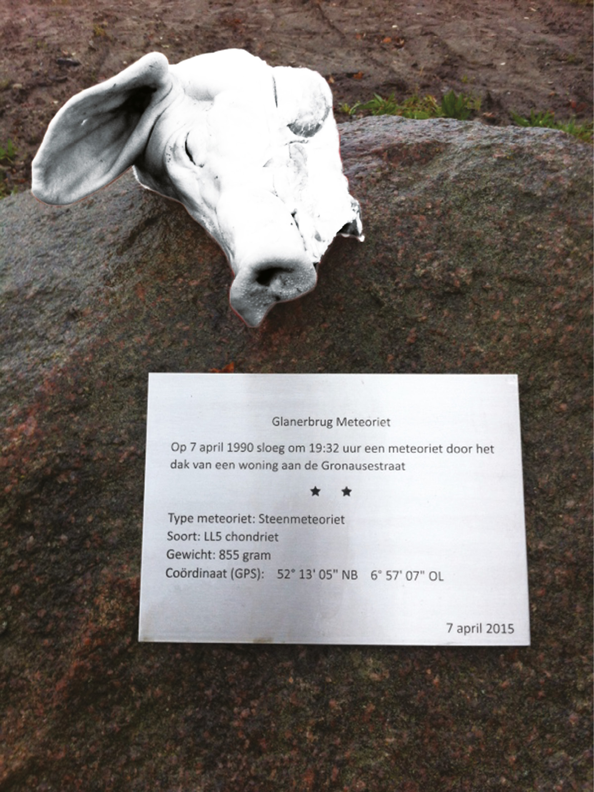

> kxx 
> hxxxxxx&lt;kxx.hxxxxxx@gmail.com&gt; 
> Apr 5 (2 days ago) 
> 
> to j.hxxxxxxx 
> Geachte Heer Hxxxxxx,
> 
> Midden maart heb ik u een voorstel gestuurd voor
> de vervaardiging van een kunstwerk dat op het Eschmarkerveld zou kunnen
> komen te staan. Het betrof een in
> brons vervaardigde varkenskop. Deze geplaatst op het monument, ter
> herinnering aan de meteoor van Glanerbrug, gelijk aan het exemplaar dat
> daar door onbekenden, in de nacht van 24 op 25 november, opgelegd
> is.
> 
> Vooralsnog heb ik nog geen
> reactie mogen ontvangen. Mijn vraag is dan ook, of mijn voorstel u in
> goede orde heeft bereikt.  Heeft u
> al kans gezien het voorstel te overwegen?  Mocht u het in het geheel niet ontvangen hebben,
> zend ik u uiteraard met plezier opnieuw het voorstel toe. In afwachting van uw reactie,
> 
> Kxx Hxxxxxxx

> Secretariaat wethouder Hxxxxxxx 
> &lt;secretariaathxxxxxxx@enschede.nl&gt; 
> Apr 5 (2 days ago) 
> 
> to me 
> Dutch 
> English 
> Translate message Turn off for: 
> Dutch Geachte mevrouw Hxxxxxx, 
> 
> Wij hebben niets ontvangen van onderstaande. Zou
> u dit nogmaals toe willen sturen t.a.v. wethouder Hxxxxxxx?
> Ik zal dit in ieder geval alvast aan de wethouder
> voorleggen.
> 
> Graag zien wij uw brief tegemoet.
> 
> Met 
> vriendelijke groet, Lxxxx de 
> Wxxxxxx 

> kim hospers 
> &lt;kim.hospers@gmail.com&gt;y
> 12:15PM (22 hours ago) 
> 
> to Secretariaat
> 
> Geachte mevrouw De Witte,
> 
> Hartelijk dank voor u snelle antwoord. Ik
> zal het opnieuw toe sturen.
> 
> Vriendelijke groet,

> Secretariaat wethouder Hxxxxxxx &lt;secretariaathxxxxxxx@enschede.nl&gt; 
> 12:17 PM (22 hours ago) to me 
> 
> Geachte mevrouw Hxxxxxxx,
> 
> In
> navolging op mijn e-mail van gisteren heb ik zojuist wethouder Hxxxxxxx
> hier over gesproken. Hij geeft aan u hartelijk te danken voor dit aanbod
> maar geen interesse te hebben. 
>  Ik hoop u hiermee voldoende te
> hebben geïnformeerd.
> 
> Met vriendelijke groet, Lxxxx de Wxxxxx

> kxx hxxxxxxxx &lt;kxx.xxxxxxx@gmail.com&gt; 
> 1:46 PM (21 hours ago) 
> 
> to Secretariaat
> 
> Geachte mevrouw Dx Wxxxxx,
> 
> Dat spijt me verschrikkelijk. Dank u voor
> de moeite en dank de wethouder voor zijn tijd.
> 
> Vriendelijke groet,
> 
> Kxx Hxxxxx

## EINDE

